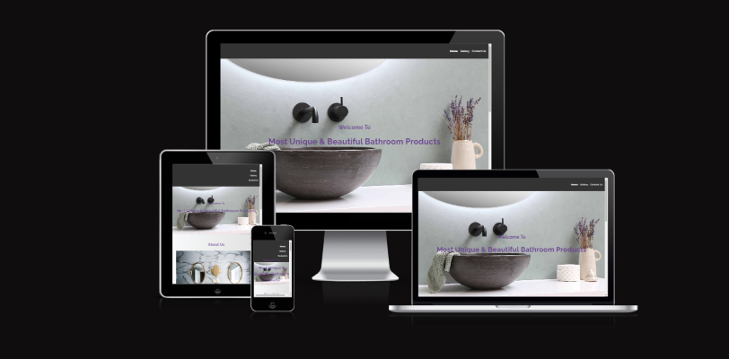

# Welcome to Innovative Bathrooms & Tiles

# To visit website please click [here](https://monikamula.github.io/Innovative-Bathrooms-Tiles/)
Innovative Bathrooms & Tiles is a website designed to showcase luxury bathroom products and tiles available in Mullingar, Ireland. The site aims to provide users with a comprehensive view of the available products through a visually appealing gallery and informative sections. This project targets homeowners, interior designers, and commercial clients looking for high-quality bathroom solutions.

## Features

The website consists of several key features that provide value to the user by showcasing the products and offering an easy way to get in touch with the company.

### Existing Features

- __Navigation Bar__
  - The responsive navigation bar includes links to the Home page, Gallery, and Contact Us page. It is consistent across all pages, allowing for easy navigation.
  - This section ensures users can easily move from one page to another on any device without using the back button.

- __Header Section__
  - The header features an eye-catching image with overlay text, introducing users to the site's purpose.
  - This section grabs users' attention and provides a clear message about the site's offerings.

- __About Us Section__
  - Provides information about the company's principles and services.
  - This section helps users understand the company's mission and what makes it unique.

- __Gallery__
  - The gallery showcases high-quality images of bathroom products and tiles.
  - This section allows users to see the variety and quality of the products available.

- __Contact Us Section__
  - Provides contact information including address, phone number, and email.
  - This section makes it easy for users to get in touch with the company for inquiries or orders.

- __Footer__
  - The footer includes links to the company's social media pages, allowing users to connect on various platforms.
  - This section helps maintain a connection with users and encourages them to follow the company on social media.

## Testing

Extensive testing has been conducted to ensure the site works well across different browsers and screen sizes. All features have been tested to ensure they function as intended and provide a seamless user experience.

### Validator Testing

- HTML
  - No errors were returned when passing through the official [W3C validator](https://validator.w3.org/nu/?doc=https%3A%2F%2Fmonikamula.github.io%2FInnovative-Bathrooms-Tiles%2F).
- CSS
  - No errors were found when passing through the official [Jigsaw validator](https://jigsaw.w3.org/css-validator/validator?uri=https%3A%2F%2Fmonikamula.github.io%2FInnovative-Bathrooms-Tiles%2Fassets%2Fcontactus.html&profile=css3svg&usermedium=all&warning=1&vextwarning=&lang=en#css).

## Deployment

The site was deployed to GitHub Pages. The steps to deploy are as follows:

- In the GitHub repository, navigate to the Settings tab.
- From the source section drop-down menu, select the main branch.
- Once the main branch has been selected, the page will be automatically refreshed with a detailed ribbon display to indicate the successful deployment.

The live link can be found here: [Innovative Bathrooms & Tiles](https://monikamula.github.io/Innovative-Bathrooms-Tiles/)

### Media

- All images used in the gallery and on the website are provided by Innovative Bathrooms & Tiles or sourced from free image sites such as Unsplash.

### Acknowledgements

- Icons used in the footer were taken from [Font Awesome](https://fontawesome.com/).

Thank you for visiting Innovative Bathrooms & Tiles!
